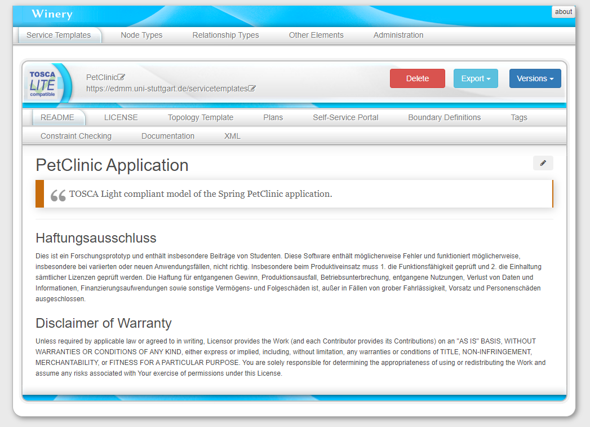
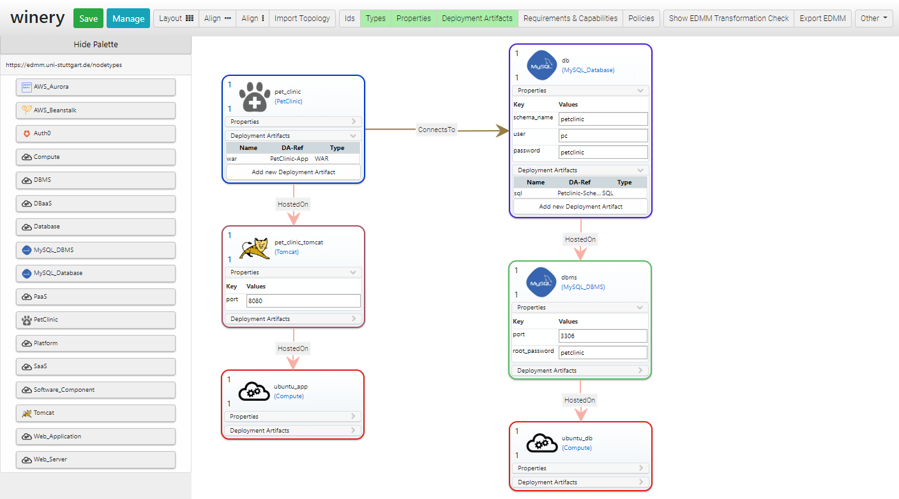

**[Welcome](#welcome) &nbsp;|&nbsp; [Quickstart](#quickstart)**

[](https://opensource.org/licenses/Apache-2.0)

## Welcome

Modeling and Transformation System for porting TOSCA to Production-Ready Deployment Technologies

## Quickstart

### Pre-requisites

* Docker 17.10.0-ce or later installed and running
* Docker Compose installed and set up

### Clone the TOSCA Lightning repository

```
git clone https://github.com/UST-EDMM/tosca-lightning
cd tosca-lightning
```

### Install the TOSCA Lightning Transformation CLI

Download the latest release:

```
curl -LSs -o edmm.zip https://github.com/UST-EDMM/transformation-framework/releases/download/v1.0.5/edmm.zip
```

Unzip archive to current directory:

```
unzip edmm.zip -d .
```

### Run the TOSCA Lightning Modeling Environment

```
docker-compose pull
docker-compose up -d
```

Open a browser a go to <http://localhost:8080> to launch the modeling environment.

The TOSCA Lightning Modeling Environment is started in the *Service Template List* view.
For the Quickstart, we prepared a TOSCA deployment model of the Spring PetClinic application.

By clicking on the *PetClinic* Service Template, you enter the *Service Template Detail* view.



In the *Topology Template* submenu, you can open the *Topology Editor*.
The Topology Editor is launched in a separate window.

In this view, the overall structure of the application is modeled.
Further, the Topology Editor is used to set any property value which will be used as configuration for the instantiation of the component.



The Quickstart repository comes already with a set of *built-in modeling types* that can be used to model new applications.
New Service Templates can be added where applications can be composed using the built-in types on the left hand side of the Topology Editor.
However, these types follow the proposed normative types by the TOSCA Simple Profile standard.
In addition, new types can be added using the *Node Type* view of the TOSCA Light Modeling Environment.

### Export the PetClinic Application

You can now go back to the *Service Template Detail* view of the PetClinic application.

Click the *Export* button and execute the *Export to EDMM* action.
The result is opened in a new browser window.

Right-click *Save as...* and save the YAML model relative to your `tosca-light` repository, e.g., to `petclinic.yml`.

### Transform to Kubernetes

Now we can use the TOSCA Lightning Transformation CLI to translate the generated model into files and artifacts required by Kubernetes for deployment.

> **Workaround: Correct file specs in `petclinic.yml`**
>
> The TOSCA Lightning Modeling Environment prototype at this stage generates absolute path based on the container's volume mount.
> To have relative file specs, relative to your `tosca-lightning` repository, you can execute the following command to fix this:
>
> ```
> sed -i 's/\/var\/opentosca\/repository/\.\/modeling-repository/' petclinic.yml
> ```

Finally, we can execute the transformation to Kubernetes using the following command:

```
./edmm transform kubernetes ./petclinic.yml
```

### Run the PetClinic Application on Kubernetes

> **Kubernetes on HyperV using minikube**
>
> Start a PowerShell with administrative rights and start a Kubernetes cluster:
>
> ```shell script
> minikube start --cpus 2 --memory 4096 --vm-driver=hyperv
> ```
>
> Configure PowerShell to use minikube's Docker environment
>
> ```shell script
> minikube docker-env | Invoke-Expression
> ```

Build Docker images on your Kubernetes cluster:

```
docker build -t db ./kubernetes/db
docker build -t pet-clinic ./kubernetes/pet_clinic
```

Apply the generated Kubernetes configuration:

```
kubectl apply -f ./kubernetes/db/db-deployment.yaml -f ./kubernetes/db/db-service.yaml
kubectl apply -f ./kubernetes/pet_clinic/pet-clinic-deployment.yaml -f ./kubernetes/pet_clinic/pet-clinic-service.yaml
```

Launch the PetClinic application:

```
minikube service pet-clinic-service
# or monitor
minikube dashboard
```

Shutdown the minikube cluster:

```
minikube stop
minikube delete
```
