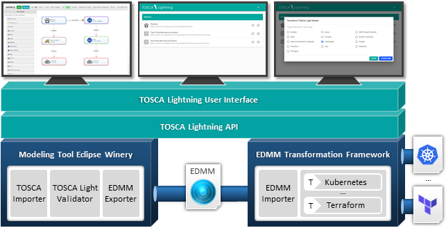
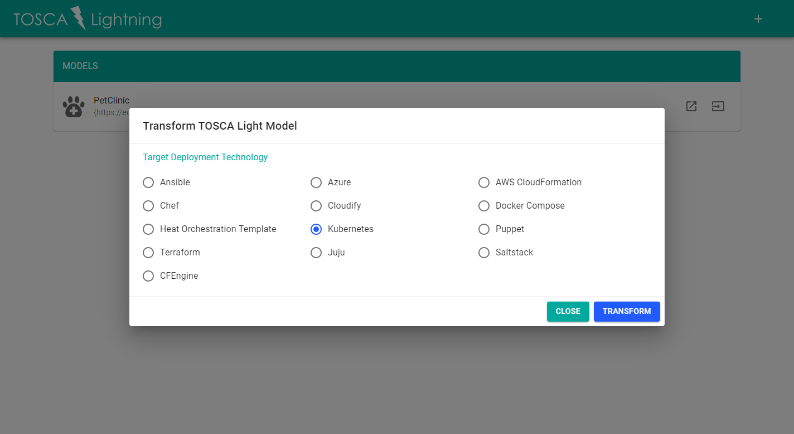

[](https://opensource.org/licenses/Apache-2.0)


[**Welcome**](#welcome) &nbsp;|&nbsp; [**Quickstart**](#quickstart) &nbsp;|&nbsp; [**Get In Touch**](#get-in-touch) &nbsp;|&nbsp; [**Learn More**](#learn-more)

---

## Welcome

TOSCA as a standardized cloud modeling language is not widely used in industry.
Concrete deployment automation technologies, such as Kubernetes, Ansible, Terraform, or AWS CloudFormation, are much more common as they often provide comprehensive tooling and support for working in modern software engineering environments.

To make TOSCA more attractive to practitioners, we introduce the **TOSCA Lightning** toolchain as *a modeling and transformation system for porting TOSCA to production-ready deployment technologies*.

**Why choose a particular deployment automation technology when TOSCA Lightning supports them all?**

In our recent research, we identified the essential modeling parts that are supported by all deployment automation technologies.
Thereby, we introduced the essential deployment metamodel (EDMM) providing a common understanding and technology-independent baseline of declarative deployment models.
Moreover, EDMM enacts the transformation from a common metamodel into technology-specific deployment models including all required files and artifacts.

Therefore, we published the *TOSCA Light modeling profile* as a reduced subset of TOSCA modeling constructs which is compliant with EDMM.
By using the TOSCA Lightning toolchain, practitioners are able to model their applications in an abstract and technology-agnostic modeling language syntax and can still use their deployment automation technology of choice for execution.

The toolchain consists of four main components:
(i) the TOSCA Lightning User Interface,
(ii) the TOSCA Lightning API,
(iii) [Eclipse Winery](https://github.com/eclipse/winery), and
(iv) the [EDMM Transformation Framework](https://github.com/UST-EDMM/transformation-framework).



TOSCA Lightning integrates Eclipse Winery as its modeling environment and the EDMM Transformation Framework for transformation (due to the fact that TOSCA Light is mappable to EDMM; we also use EDMM as the transfer format).

Eclipse Winery is a web-based environment to graphically model TOSCA-based application topologies and can be launched thru the TOSCA Lightning User Interface.
It provides a *Management Interface* to manage all TOSCA related entities, such as node types, their property definitions, operations, and artifacts.
Further, it provides a *Topology Modeler* component which enables the graphical composition of the application and its desired target state to be deployed.

The modeling environment checks the TOSCA Light compliance and its API is able to return a list of such compliant TOSCA service templates.
Each created or imported TOSCA model may be returned by this API.
Inside Eclipse Winery, the user has access to a list of violated conditions when a TOSCA service template is not compliant with TOSCA Light.

The EDMM Transformation Framework provides the ability to transform a given TOSCA Light model into a set of files and artifacts required by a certain deployment automation technology.
Using the TOSCA Lightning User Interface, a user selects a certain target deployment technology and is able to trigger the transformation.
The TOSCA Lightning API utilizes the EDMM Transformation Framework such that the required files and templates are generated.
The EDMM Transformation Framework is plugin-based and, among others, supports technologies such as Kubernetes, Terraform, or Ansible ([full list](https://github.com/UST-EDMM/transformation-framework#plugins)).
The transformation result can be downloaded thru the TOSCA Lightning User Interface.


## Quickstart

For a quick start, we outline a step-by-step guide to model, transform, and deploy a TOSCA Light application to **Kubernetes**.
For the sake of demonstration, we use the Spring PetClinic application which demonstrates the use of the Spring Boot framework.
It's a web application and runs on a Tomcat web server while connecting to a MySQL database to store its data.

The model is created using the Eclipse Winery modeling environment and can be launch from the TOSCA Lightning user interface.
Notably, the model is not specifically composed for Kubernetes as the target runtime environment.
It is rather modeled in a generic, component-based manner.
Afterwards, the resulting model is translated using the EDMM Transformation Framework to the specific files and templates required by Kubernetes, e.g., Dockerfiles, deployment and service descriptors.

### Pre-requisites

* Docker 17.10.0-ce or later installed and running
* Docker Compose installed and set up

### Clone the TOSCA Lightning repository

```
git clone https://github.com/UST-EDMM/tosca-lightning
cd tosca-lightning
```

### Run the TOSCA Lightning User Interface

```
docker-compose pull
docker-compose up -d
```

Open a browser a navigate to <http://localhost:9000>.

The TOSCA Lightning User Interface is started and presents a list of available TOSCA Light models.
For the Quickstart, we prepared a TOSCA deployment model of the Spring PetClinic application.

> 

By clicking on the edit button of the *PetClinic* model, you can launch the Topology Editor to graphically view and compose the application structure.
The Topology Editor is launched in a separate window.
Further, the Topology Editor is used to set any property value which will be used as configuration for the instantiation of the component.

> 

The Quickstart repository comes already with a set of *built-in modeling types* that can be used to model new applications.
New TOSCA Service Templates can be added where applications can be composed using the built-in types on the left hand side of the Topology Editor.
However, these types follow the proposed normative types by the TOSCA Simple Profile standard.
In addition, new types can be added using the *Node Type* view of the TOSCA Light Modeling Environment.

### Transform PetClinic Application to Kubernetes 

We utilize the EDMM Transformation Framework to translate the generated model into files and artifacts required by Kubernetes for deployment.
In the TOSCA Lightning user interface, click on the transformation button of the PetClinic application.
In the presented pop-up, choose *Kubernetes* and click *Transform*.
After the transformation was successful, you can download an archive containing all required files and artifacts to deploy the PetClinic application to Kubernetes.

> 

### Run the PetClinic Application on Kubernetes

> **Kubernetes on HyperV using minikube**
>
> Start a PowerShell with administrative rights and start a Kubernetes cluster:
>
> ```
> minikube start --cpus 2 --memory 4096 --vm-driver=hyperv
> ```
>
> Configure PowerShell to use minikube's Docker environment
>
> ```
> minikube docker-env | Invoke-Expression
> ```

Extract the downloaded archive, open a command-prompt, and change to the respective directory.  
Build Docker images on your Kubernetes cluster:

```
docker build -t db ./db
docker build -t pet-clinic ./pet_clinic
```

Apply the generated Kubernetes configuration:

```
kubectl apply -f ./db/db-deployment.yaml -f ./db/db-service.yaml
kubectl apply -f ./pet_clinic/pet-clinic-deployment.yaml -f ./pet_clinic/pet-clinic-service.yaml
```

Launch the PetClinic application:

```
minikube service pet-clinic-service
# or monitor
minikube dashboard
```

Shutdown the minikube cluster:

```
minikube stop
minikube delete
```


## Get In Touch

Are you interested in our research, do you have any questions or would you like further information?
Just get in touch with us below:

* Michael Wurster ([@miwurster](https://github.com/miwurster), [write a mail](mailto:wurster@iaas.uni-stuttgart.de?subject=[GitHub]%20TOSCA%20Lightning))


## Learn More

* Michael Wurster, Uwe Breitenbücher, Michael Falkenthal, Christoph Krieger, Frank Leymann & Karoline Saatkamp:
  [**The Essential Deployment Metamodel: A Systematic Review of Deployment Automation Technologies**](https://link.springer.com/article/10.1007%2Fs00450-019-00412-x).
  In: SICS Software-Intensive Cyber-Physical Systems (2019)
* Michael Wurster, Uwe Breitenbücher, Antonio Brogi, Ghareeb Falazi, Lukas Harzenetter, Frank Leymann, Jacopo Soldani and Vladimir Yussupov:
  [**The EDMM Modeling and Transformation System**](https://www.iaas.uni-stuttgart.de/publications/ICSOC-2019-The-EDMM-Modeling-and-Transformation-System.pdf).
  In: Service-Oriented Computing - ICSOC 2019 Workshops
* Michael Wurster, Uwe Breitenbücher, Lukas Harzenetter, Frank Leymann, Jacopo Soldani and Vladimir Yussupov:
  **TOSCA Light: Bridging the Gap Between TOSCA Specification and Production-Ready Deployment Technologies**.
  In: Proceedings of the 10th International Conference on Cloud Computing and Services Science (CLOSER), 2020 **(To Appear)**
